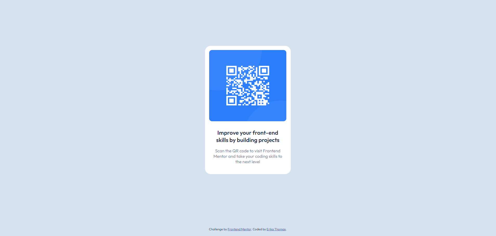

# Frontend Mentor - QR code component solution

This is a solution to the [QR code component challenge on Frontend Mentor](https://www.frontendmentor.io/challenges/qr-code-component-iux_sIO_H). Frontend Mentor challenges help you improve your coding skills by building realistic projects. 

## Table of contents

- [Overview](#overview)
  - [Screenshot](#screenshot)
  - [Links](#links)
- [My process](#my-process)
  - [Built with](#built-with)
  - [What I learned](#what-i-learned)
  - [Continued development](#continued-development)
  - [Useful resources](#useful-resources)
- [Author](#author)

## Overview

### Screenshot



### Links

- Solution URL: [Add solution URL here](https://github.com/erikathomas/frontendMentor-qr-component)
- Live Site URL: [Add live site URL here](https://your-live-site-url.com)

## My process

### Built with

- Semantic HTML5 markup
- CSS custom properties
- Flexbox

### What I learned

I learned how to center a div horizontally and vertically using flexbox.

Use this section to recap over some of your major learnings while working through this project. Writing these out and providing code samples of areas you want to highlight is a great way to reinforce your own knowledge.

To see how you can add code snippets, see below:

```css
 body {
    margin: 0;
    background-color: hsl(212, 45%, 89%);
    font-family: 'Outfit', sans-serif;
    font-size: 15px;
    display: flex;
    flex-direction: column;
    justify-content: center;
    align-items: center;
    height: 100vh;
  }
```
### Continued development

I´m impressed by everything that is possible with flexbox, so I want to keep lerning everything about so I can build complex layouts in the future. 


### Useful resources

- [A Complete Guide to Flexbox](https://css-tricks.com/snippets/css/a-guide-to-flexbox/) - This is like the flexbox bible.


## Author

- Frontend Mentor - [@erikathomas](https://www.frontendmentor.io/profile/erikathomas)
- Twitter - [@erika_thomas](https://twitter.com/Erika_Thomas)
